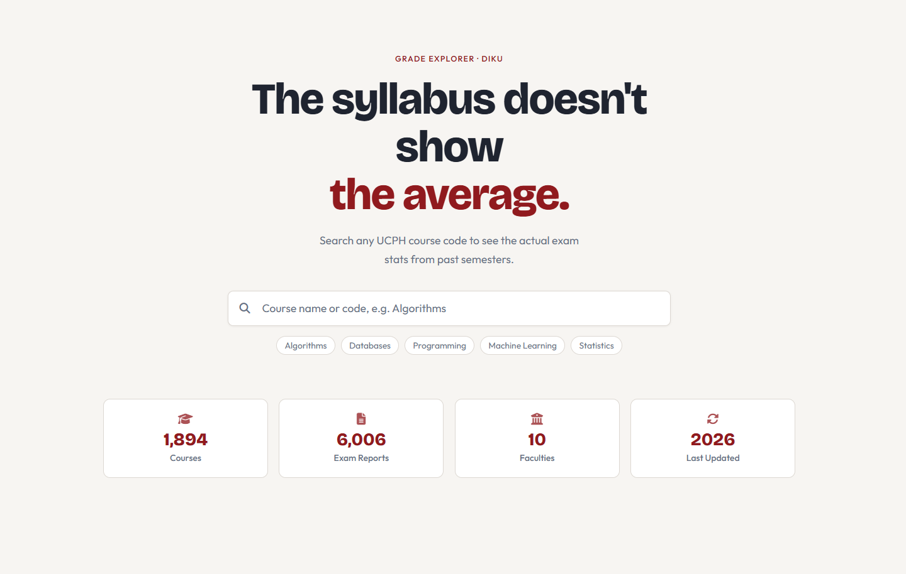
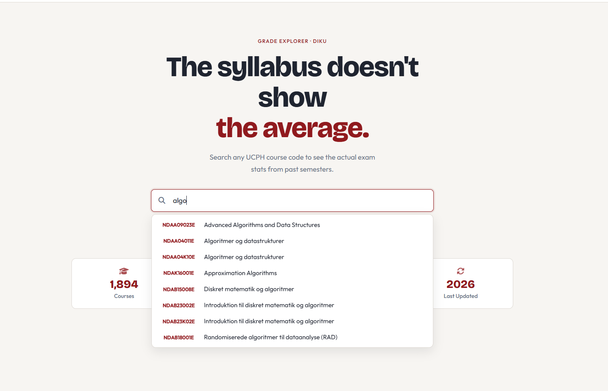
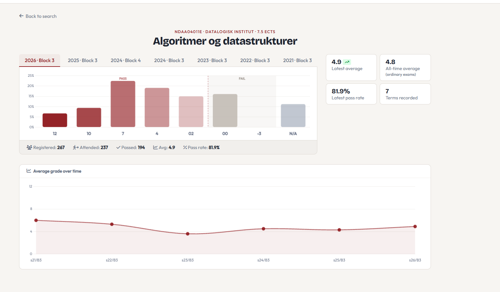
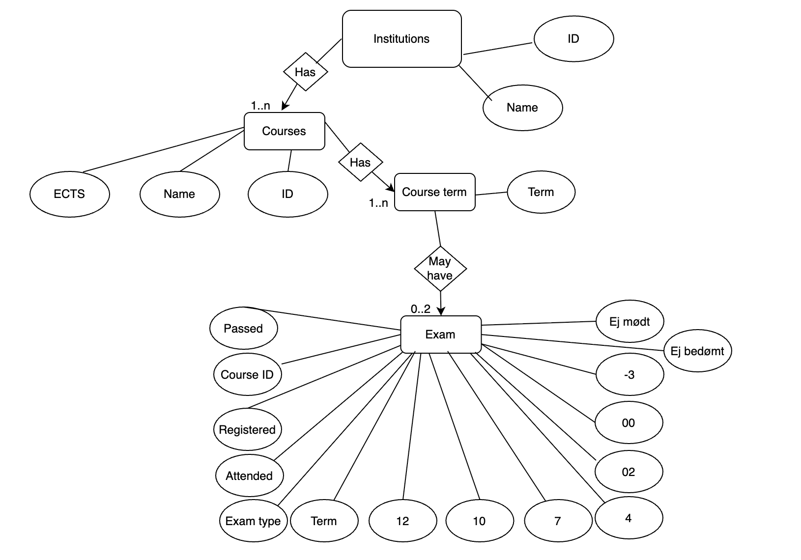

# KU-Grades
KU-Grades is a prototype idea for an alternative to the University of Copenhagen's grade statistics system, which can be seen here: https://karakterstatistik.stads.ku.dk/#. The prototype is currently built with data only from the Faculty of Science but can easily be extended with data from other faculties. The data is scraped from the publicly available site with our own custom-built scraper.

## Dependencies
To build the database you first need to install all the required dependencies, which are listed below:

```
flask           (3.1.3)     # To serve the web application
livereload      (2.7.1)     # To serve a local server and provide instantaneous live changes
psycopg2        (2.9.12)    # To connect and interact with postgres database
```

Additionally, if you would like to try the scraper you also need the following dependencies:

```
beautifulsoup4  (4.14.3)    # To parse html  
requests        (2.32.5)    # To make http requests
tqdm            (4.67.1)    # Provides a progress bar
```

We recommend using a Python virtual environment. On most systems, Python 3 is available as `python3`:

```
python3 -m venv .venv
source .venv/bin/activate
```

Inside an activated virtual environment, `python` should point to the virtual environment's Python 3 interpreter. You can then install all dependencies using the `requirements.txt` file by running:

```
pip install -r requirements.txt
```

## Setup
NOTE: Before building the database, make sure PostgreSQL is running. Since starting it differs per operating system, we leave this step to the user. Also make sure your virtual environment is activated before running the setup script.

To build and populate the database, execute the `setup.sh` script, which performs the following steps:

1. Creates the database with the name KUGrades:
```
psql -U postgres -c "CREATE DATABASE kugrades;"
```

2. Constructs the database structure using the defined schema, which follows the E/R diagram:
```
psql -U postgres -d kugrades < schema.sql 
```

3. Populates the database with data from the `data/` folder, which has been scraped using the scraper (see `scrape.py`):
```
python3 setup.py
```

## Usage
Starting the application is straightforward, simply run:
```
python3 app.py
```
This starts a local development server at http://localhost:7070.

## Interaction Instructions
Once you have started the application, you can open it on http://localhost:7070 in a browser.

Users can interact with KU grades by searching for a course using the search bar on the front page. The search works similar to a Google style search field; users begin typing a course name or code and the application searches for matching courses. Unfortunately a current limitation to our implementation is that it only supports exact or partial spelling, but does not correct typos, thus misspelled course names will not return results.

When users begin typing, the application shows a dropdown list of possible matching courses. Selecting one of those results opens up the individual course page.

On this page, users can view grade statistics such as number of registered students, attendance, passed students, pass rate, average grade, and the grade distribution. Users can also switch between different terms for the course to compare statistics across semesters.

## Screenshots
The landing page contains the main search bar. This is where users start by typing a course name or course code.



When a user begins searching, KU-Grades shows a dropdown list of possible course results.



The individual course page shows the grade distribution, summary statistics, and term navigation for the selected course.



## Architecture
`app.py` serves as the main entry point, handling routing and rendering of HTML templates. When a user submits a search request, Flask routes it to the appropriate handler, which:

1. Loads the corresponding SQL query from the `queries/` folder
2. Connects to the database and executes the query
3. Performs any necessary data transformations
4. Returns the processed data to the frontend for display

## E/R Diagram


## Authors
- Roni Temizsoy (rpg993)
- Albert Kuhlman Mogensen (chs235)
- Jack Bjerregaard (ldh587)

## AI declaration
[AI Declaration](AI%20for%20DIS%20PDF.pdf)
